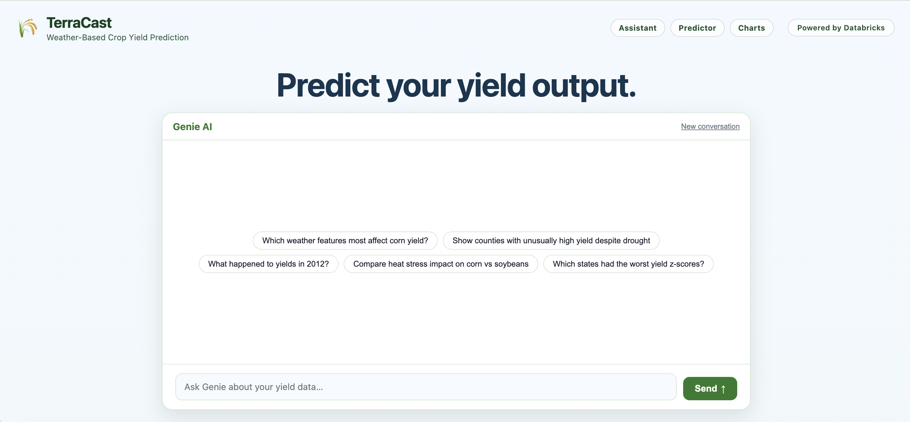

# TerraCast

[](https://devpost.com/software/terracast)

Weather-based crop yield prediction and agricultural intelligence for U.S. corn and soybeans. TerraCast pairs regional LightGBM models with a Databricks Genie AI assistant, served through a FastAPI app and deployed as a Databricks App on top of a Unity Catalog lakehouse.



## What it does

- **Yield prediction** - Predicts county- or state-level corn/soybean yield (bu/acre) from growing-season weather features using six regional LightGBM models (corn and soybeans x midwest/plains/south). Falls back to a heuristic model when a model artifact is missing.
- **Feature lookup** - Pulls historical weather + yield features for a county/year/crop directly from a Unity Catalog Delta table via the Databricks SQL Warehouse, so the UI can prefill prediction inputs.
- **Genie AI chat** - Natural-language Q&A over the merged dataset and the predictions log, backed by a Databricks Genie Space.
- **Prediction logging** - Appends every prediction to a Delta audit table (`predictions_log`) for later analysis.

## Architecture

```
Browser UI (static/index.html)
        |
        v
FastAPI app (app.py)
  |-- GET  /features   -> SQL SELECT on UC Delta "merged"        (delta_store.py)
  |-- POST /predict    -> regional LightGBM model + SQL INSERT into "predictions_log"
  |-- POST /chat       -> Databricks Genie API (databricks-sdk)
  |-- GET  /health     -> model + lakehouse status
        |
        v
Databricks: SQL Warehouse, Unity Catalog Delta tables, UC Volume (model artifacts), Genie Space
```

Key design point: the app never starts Spark on the request path. All reads/writes go through the Databricks SQL Statement API using `databricks-sdk`. Local PySpark is only used for the learning examples under `examples/python/`.

## Project layout

| Path | Purpose |
|------|---------|
| `app.py` | FastAPI app: prediction logic, Genie integration, routes |
| `delta_store.py` | Unity Catalog Delta access via SQL Warehouse (feature fetch + prediction logging) |
| `app.yaml` | Databricks App launch command and environment variables |
| `genie_instructions.md` | System prompt / dataset description for the Genie Space |
| `static/` | Frontend (`index.html`), county GeoJSON, graph assets |
| `models/` | Trend/baseline JSON artifacts; regional `.pkl` models (downloaded, gitignored) |
| `models/databricks_hackathon/` | Notebooks and data used to build the models (ETL, training, anomaly detection) |
| `sql/` | DDL/reference for `merged` and `predictions_log` tables |
| `scripts/` | Model download, artifact export, and local Delta/Spark helpers |
| `examples/python/` | Upstream Delta Lake examples for local learning only |
| `docs/` | Setup and data reference (see below) |

## Models

Six regional LightGBM boosters are loaded from `MODEL_VOLUME_PATH` (a UC Volume in production, or local `models/`):

```
lgbm_corn_midwest  lgbm_corn_plains  lgbm_corn_south
lgbm_soybeans_midwest  lgbm_soybeans_plains  lgbm_soybeans_south
```

State-to-region mapping, per-state trend polynomials (`*_trend.json`), and state/county baselines (`*_baselines.json`) are applied during feature engineering. Predicted yields are bucketed into `poor / average / good / excellent`.

## API

| Method | Path | Description |
|--------|------|-------------|
| `GET` | `/` | Serves the web UI |
| `GET` | `/features` | Fetch merged weather+yield features (`state_abbr`, `county_fips`, `year`, `crop_type`, `is_irrigated`) |
| `POST` | `/predict` | Predict yield from a `YieldInput` payload |
| `POST` | `/chat` | Ask Genie a natural-language question |
| `GET` | `/crops` | List supported crops |
| `GET` | `/health` | Model + lakehouse health status |

## Configuration

Set via `.env` locally or `app.yaml` `env:` on Databricks.

| Variable | Default | Purpose |
|----------|---------|---------|
| `SQL_WAREHOUSE_ID` | (required for lakehouse) | Databricks SQL Warehouse ID |
| `DELTA_TABLE_MERGED` | `workspace.default.merged` | Merged yield+weather table |
| `DELTA_TABLE_PREDICTIONS` | (unset) | Prediction audit table |
| `MODEL_VOLUME_PATH` | `models` | UC Volume or local dir with model artifacts |
| `LAKEHOUSE_ENABLED` | `true` | Enable SQL Warehouse access |
| `LOG_PREDICTIONS` | `true` | Log predictions to Delta |
| `GENIE_SPACE_ID` | (unset) | Databricks Genie Space ID |
| `DATABRICKS_HOST` | (auto on Databricks) | Workspace host |

## Running locally

```bash
python3 -m venv .venv
source .venv/bin/activate
pip install -r requirements.txt

# optional: download model artifacts
python3 scripts/download_models.py

# start the app (http://localhost:8000)
python3 app.py
```

Authentication to Databricks uses a cached token (`~/.databricks/token-cache.json`) or external-browser OAuth.

## Deploying to Databricks

See [`docs/SETUP_DATABRICKS.md`](docs/SETUP_DATABRICKS.md) for the full checklist:

1. Create/confirm the `merged` Delta table and grant `SELECT`.
2. Upload model artifacts to a UC Volume and grant `READ VOLUME`.
3. Create a SQL Warehouse and set app env vars in `app.yaml`.
4. Create the `predictions_log` table ([`sql/predictions_log.sql`](sql/predictions_log.sql)).
5. `databricks sync` + `databricks apps deploy`.
6. Verify with `curl https://<app-url>/health`.

## Data

The canonical dataset is `workspace.default.merged`: U.S. county-level corn and soybean yields (2010-2024) joined with NOAA growing-season weather. One row per `(state_fips, county_fips, year, commodity, irrigation)`. Full schema in [`docs/DATA.md`](docs/DATA.md).

## Local Delta Lake examples (optional)

The scripts in `examples/python/` are the official Delta Lake examples for learning only and are not part of the request path. Requires Java 17 and `requirements-delta.txt`. See [`docs/DELTA_LAKE.md`](docs/DELTA_LAKE.md).

## Documentation

- [`docs/SETUP_DATABRICKS.md`](docs/SETUP_DATABRICKS.md) - Deployment checklist
- [`docs/DATA.md`](docs/DATA.md) - Table schemas and env vars
- [`docs/DELTA_LAKE.md`](docs/DELTA_LAKE.md) - Local Delta/Spark examples
