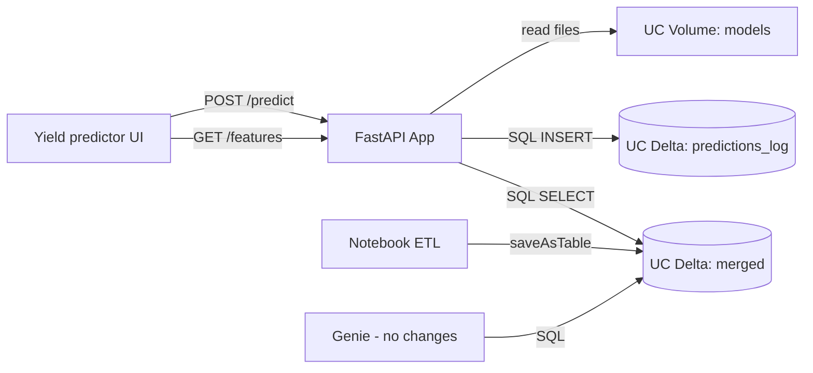

# TerraCast — Databricks Lakehouse Setup (Your Checklist)

Genie is already configured by your teammate — **do not change Genie**. This guide wires the **Databricks App** to Unity Catalog Delta via SQL Warehouse.

**Code:** `delta_store.py`, `GET /features`, lakehouse `/health`, and UI prefill are in the repo.

---

## Architecture (how it works)



- **Delta** = storage format under UC tables.
- **App** never starts Spark per request; it uses **SQL Warehouse** + existing `databricks-sdk`.
- **LightGBM** `.txt` + JSON trend/baselines live on a **Volume** (or `models/` in the app bundle).

---

## Phase 1 — Merged Delta table (you)

### 1.1 Confirm table name

In Databricks SQL:

```sql
SHOW TABLES IN workspace.default LIKE 'merged*';
SELECT COUNT(*) FROM workspace.default.merged;
```

If empty/missing, run your ETL notebook ([`models/databricks_hackathon/dh.py`](../models/databricks_hackathon/dh.py)) and persist:

```python
final_df.write.format("delta").mode("overwrite").saveAsTable("workspace.default.merged")
```

### 1.2 Grants

Replace `` `your-app-principal` `` with the App’s service principal or user:

```sql
GRANT USE CATALOG ON CATALOG workspace TO `your-app-principal`;
GRANT USE SCHEMA ON SCHEMA workspace.default TO `your-app-principal`;
GRANT SELECT ON TABLE workspace.default.merged TO `your-app-principal`;
```

---

## Phase 2 — Model artifacts on a Volume (you)

### 2.1 Create Volume (UI)

Catalog Explorer → your catalog → Schemas → create schema `terract` (optional) → **Volumes** → Create → name `models`.

### 2.2 Upload six files

Upload trained artifacts to e.g. `/Volumes/workspace/terract/models/`:

| File | Purpose |
|------|---------|
| `corn_model.txt` | LightGBM corn |
| `soybean_model.txt` | LightGBM soy |
| `corn_trend.json` | State polynomial trends |
| `soybean_trend.json` | |
| `corn_baselines.json` | State/county baselines |
| `soybean_baselines.json` | |

```bash
# Sync + deploy from repo root (profile from auth login):
databricks sync . \
  /Workspace/Users/humfanator@gmail.com/databricks_apps/terracast_2026_02_28-23_01/nodejs-fastapi-hello-world-app

databricks apps deploy terracast \
  --source-code-path /Workspace/Users/humfanator@gmail.com/databricks_apps/terracast_2026_02_28-23_01/nodejs-fastapi-hello-world-app
```

Use [`.databricksignore`](../.databricksignore) to skip large hackathon CSVs if sync fails on TLS.

```bash
# Example CLI (adjust profile/host):
databricks fs cp corn_model.txt dbfs:/Volumes/workspace/terract/models/corn_model.txt
```

### 2.3 Grant read on Volume

```sql
GRANT READ VOLUME ON VOLUME workspace.terract.models TO `your-app-principal`;
```

---

## Phase 3 — SQL Warehouse + App env (you)

### 3.1 SQL Warehouse

1. **SQL** → **SQL Warehouses** → create or use Serverless.
2. Copy **Warehouse ID** (URL fragment or warehouse settings).

### 3.2 App environment variables

The **Environment** tab in the Apps UI is read-only. Define variables in [`app.yaml`](../app.yaml) `env:` and redeploy.

In the Databricks App → **Environment variables** (after deploy, read-only view):

| Variable | Example |
|----------|---------|
| `SQL_WAREHOUSE_ID` | `a1b2c3d4e5f6g7h8` |
| `DELTA_TABLE_MERGED` | `workspace.default.merged` |
| `DELTA_TABLE_PREDICTIONS` | `workspace.default.predictions_log` |
| `MODEL_VOLUME_PATH` | `/Volumes/workspace/terract/models` |
| `LAKEHOUSE_ENABLED` | `true` |
| `LOG_PREDICTIONS` | `true` |
| `GENIE_SPACE_ID` | *(already set)* |

`DATABRICKS_HOST` and OAuth for the App are usually automatic.

### 3.3 Redeploy

Redeploy/sync the app after env vars and new code are in the bundle.

### 3.4 Verify

```bash
curl https://<your-app-url>/health
curl "https://<your-app-url>/features?state_abbr=IL&county_fips=97&year=2019&crop_type=Soybeans&is_irrigated=0"
```

---

## Phase 4 — Predictions log table (you)

Run in SQL editor ([`sql/predictions_log.sql`](../sql/predictions_log.sql)):

```sql
CREATE TABLE IF NOT EXISTS workspace.default.predictions_log (
  predicted_at TIMESTAMP,
  crop_type STRING,
  state_abbr STRING,
  state_fips INT,
  county_fips INT,
  year INT,
  is_irrigated INT,
  predicted_yield DOUBLE,
  yield_category STRING,
  model_version STRING,
  input_json STRING
) USING DELTA;
```

```sql
GRANT SELECT, MODIFY ON TABLE workspace.default.predictions_log TO `your-app-principal`;
```

---

## Phase 5 — Optional ops (you)

- Weekly job: `OPTIMIZE workspace.default.predictions_log;`
- Keep [`docs/DELTA_LAKE.md`](DELTA_LAKE.md) examples for learning only — production uses UC + SQL.

---

## Troubleshooting

| Symptom | Fix |
|---------|-----|
| `/health` → `merged_table: false` | Wrong table name, missing `SELECT` grant, or warehouse stopped |
| `/features` 503 | `SQL_WAREHOUSE_ID` unset or `LAKEHOUSE_ENABLED=false` |
| `/features` 404 | No row for that county/year/crop/irrigation combo |
| Models `loaded: false` | Files missing on Volume or wrong `MODEL_VOLUME_PATH` |
| Predictions not logged | Create `predictions_log` table + `INSERT` grant; set `DELTA_TABLE_PREDICTIONS` |
| Startup still says missing model | Redeploy after uploading Volume files |

---

## Export JSON artifacts from merged table (optional)

If trend/baseline JSON files are missing, run [`scripts/databricks/export_model_artifacts.py`](../scripts/databricks/export_model_artifacts.py) on a cluster, then copy outputs to your Volume alongside the `.txt` model files.
